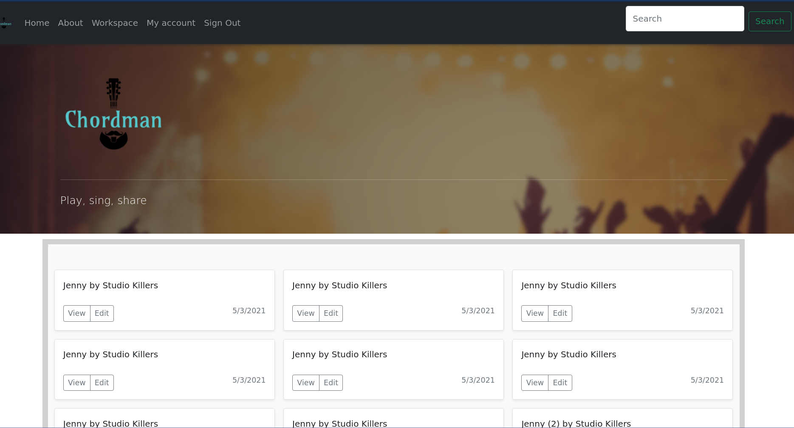
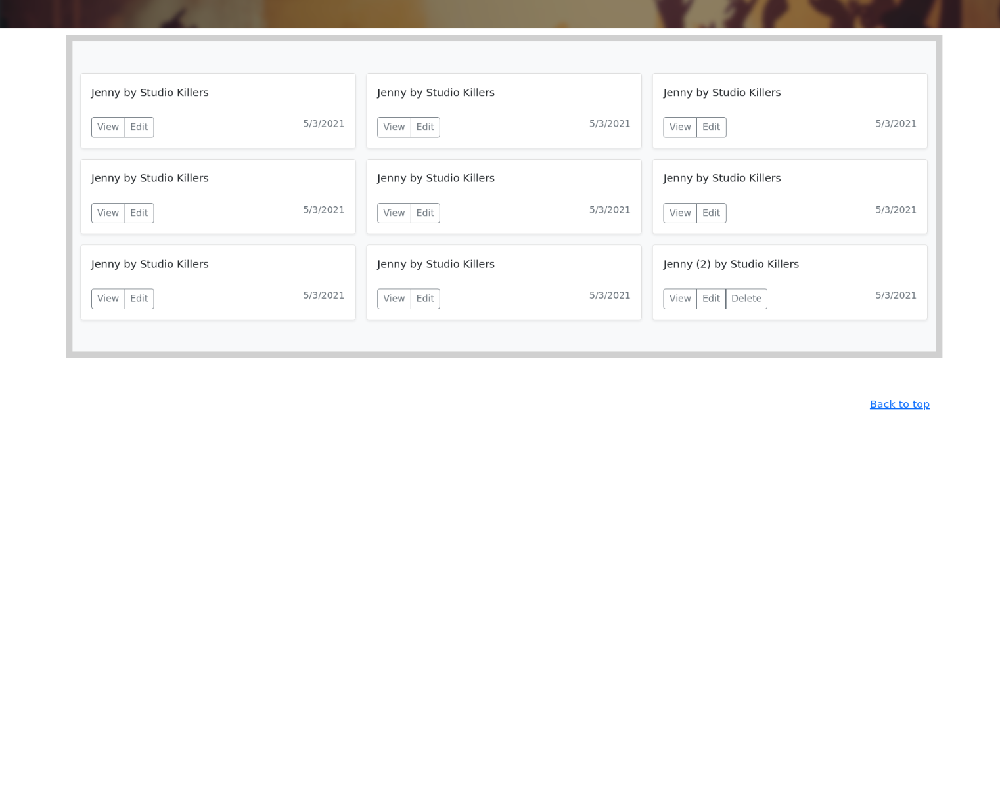
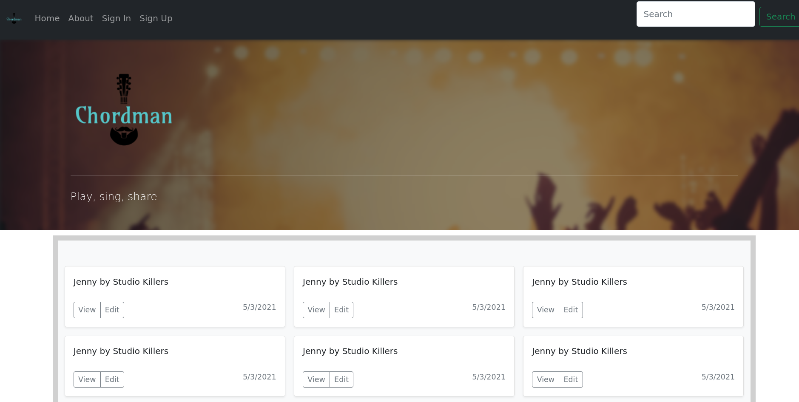
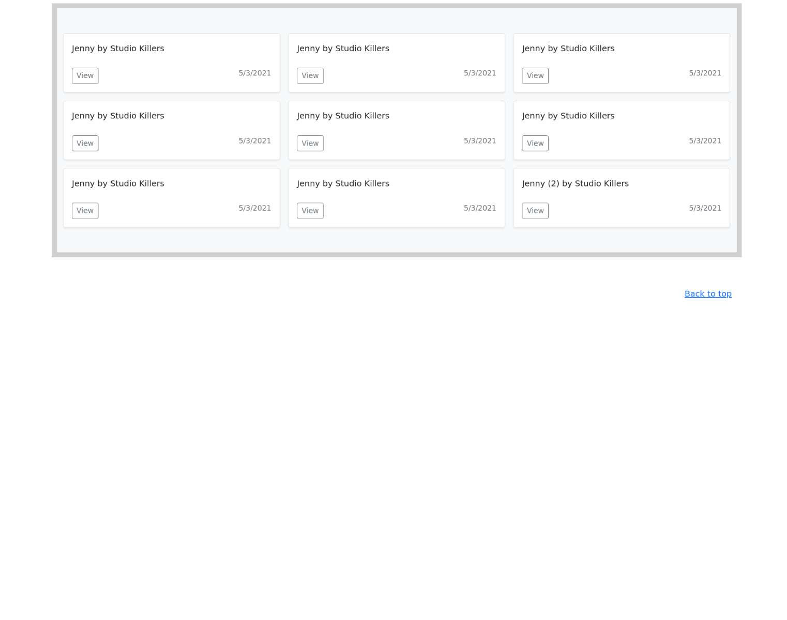
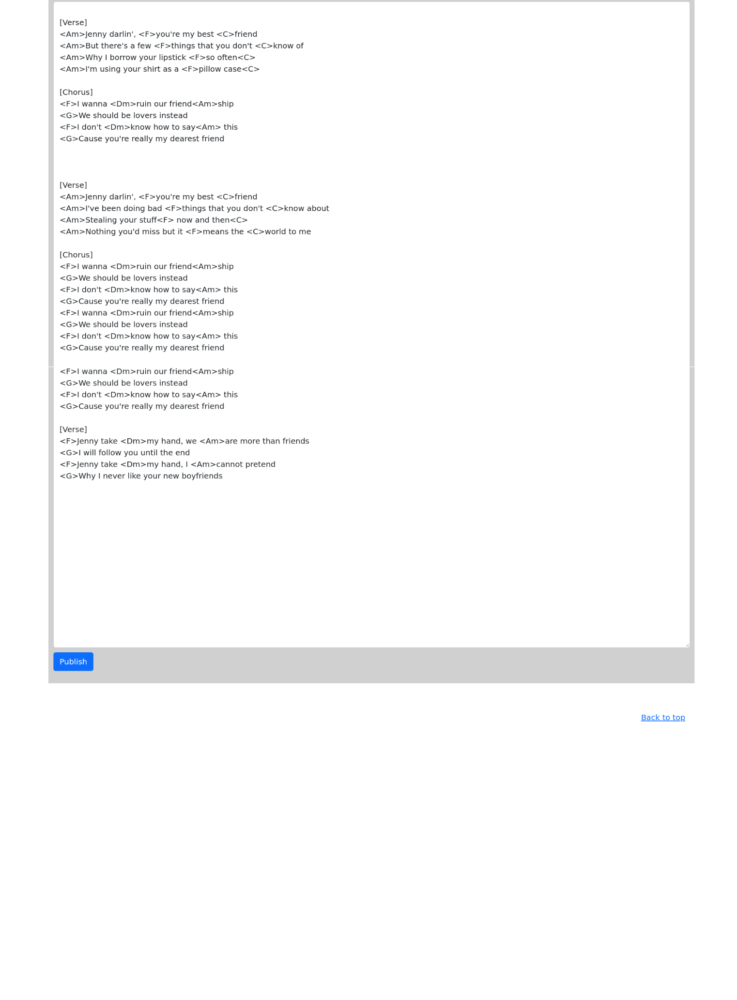
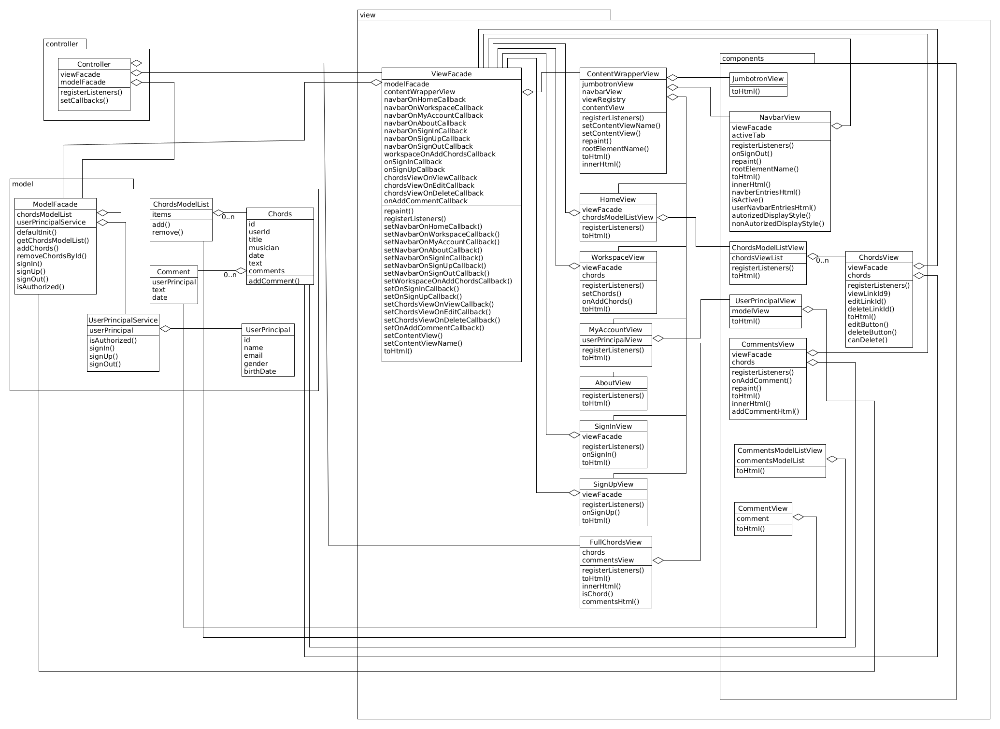

# Лабораторна робота №2
__Мета:__ ознайомитись із засобами мови Javascript та навчитись їх застосовувати побудови Web-інтерфейсу користувача.

__Загальне завдання:__ розробити функціональність для статичних сторінок Web-додатку першої лабораторної роботи із використанням шаблону MVC

__Інструменти розробки:__ мови HTML5, CSS3, Javascript.

__Зауваження:__ Web-фреймворки (ReactJS, AngularJS, VueJS) не використовувати!

## Результат:
#### [Спробувати у браузері](https://kubayof.github.io/web_labs)
### Навігаційна панель після авторизації:

### Головна сторінка після авторизації:

### Навігаційна панель до авторизації:

### Головна сторінка після авторизації:

### Робоча сторінка після натиску на кнопку 'Edit' на головній сторінці:

Незареєстровані користувачі не можуть видаляти або додавати акорди. Зареєстровані користувачі можуть видаляти лише свої акорди.
Можливо також модифікувати акорди інших користувачів. Після натиску на кнопку 'Publish' буде доданий новий варіант акордів.
### UML діаграма класів:
