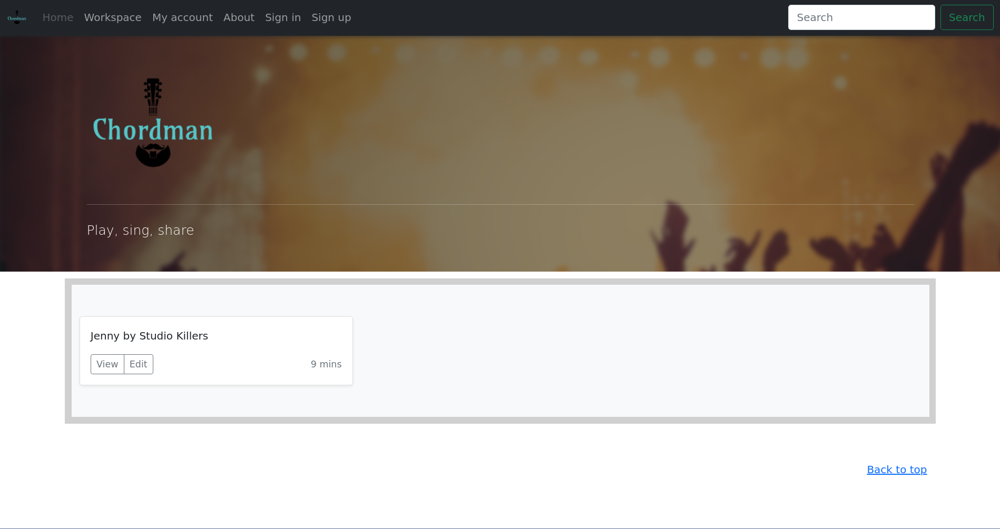
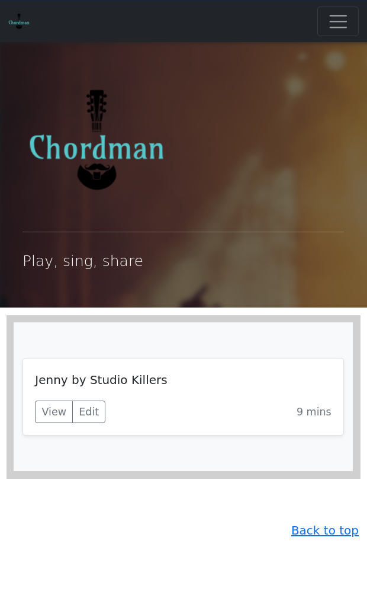
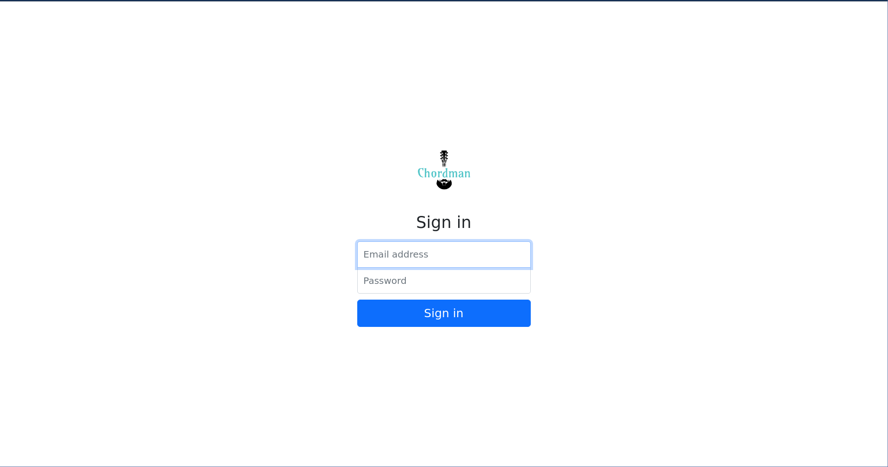
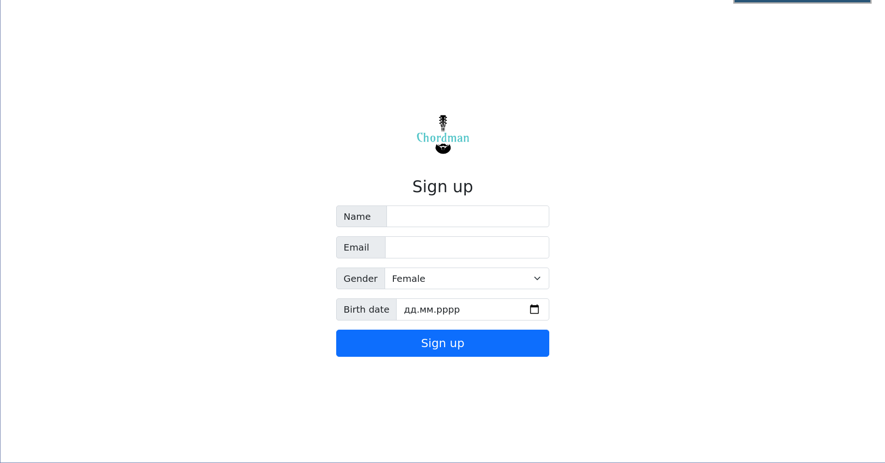
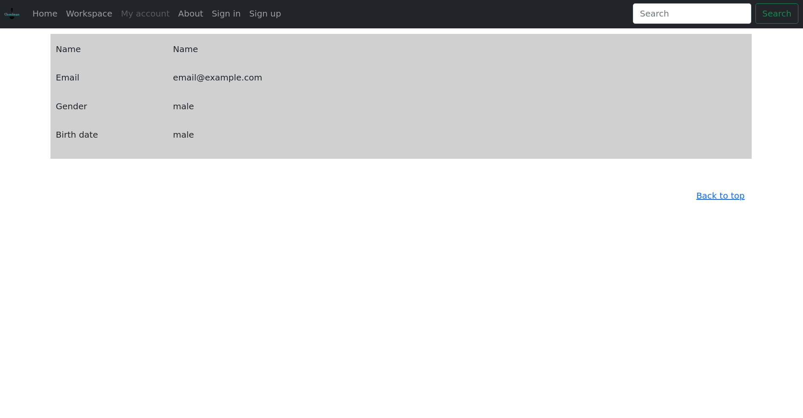
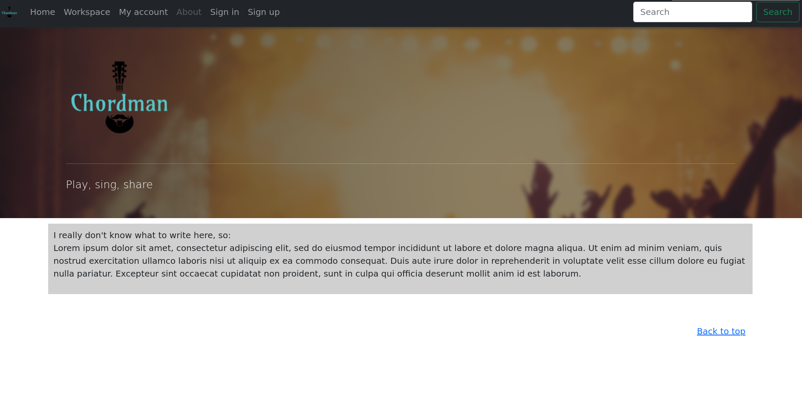
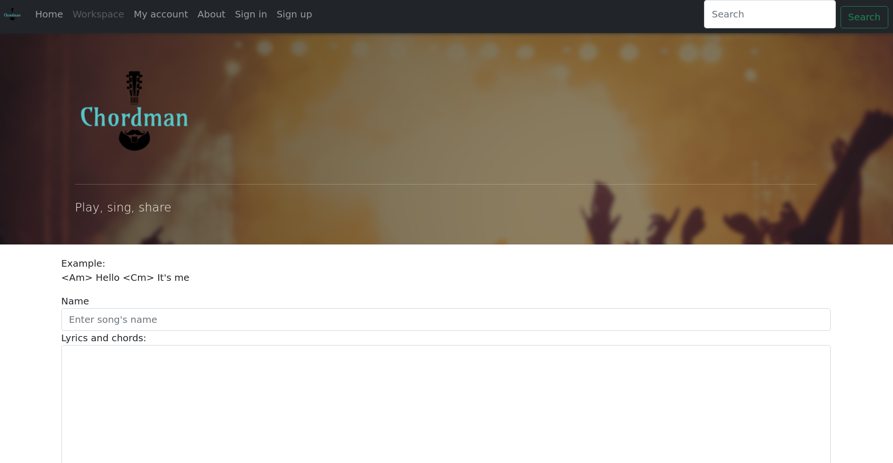

# Лабораторна робота №1
__Мета:__ ознайомитись із засобами мов HTML5 та CSS3 та навчитись застосовувати бібліотеки Twitter Bootstrap/Material UI щодо швидкої побудови Web-інтерфейсу користувача.

__Загальне завдання:__ розробити статичні Web-сторінки додатку та перевірити коректне їх відображення на екранах різного розміру.

__Інструменти розробки:__ мови HTML5, CSS3, фреймворки Twitter Bootstrap або Material UI

__Зауваження:__ програмувати функціональність сайту не потрібно (!)

## Результат:
### Головна сторінка:

### Вхід:

### Реєстрація:

### Інформація про користувача:

### Про додаток:

### Редактор акордів:

